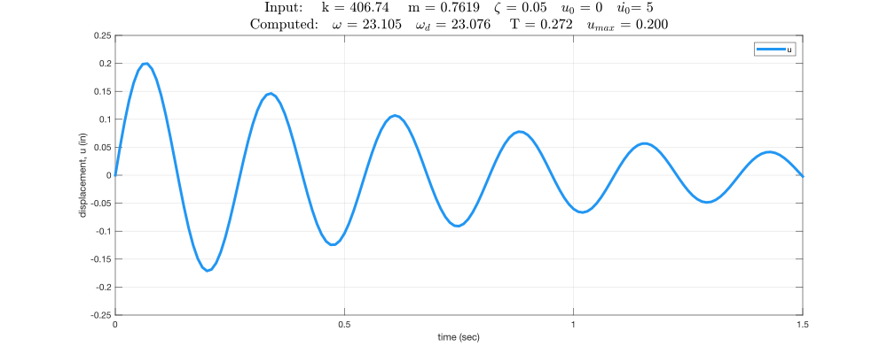
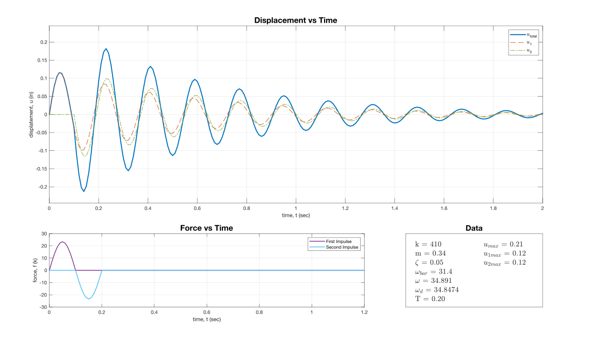
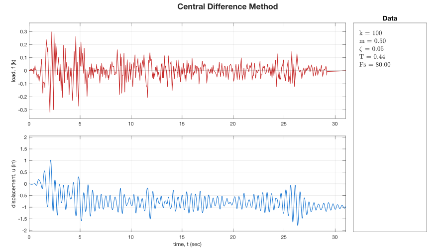
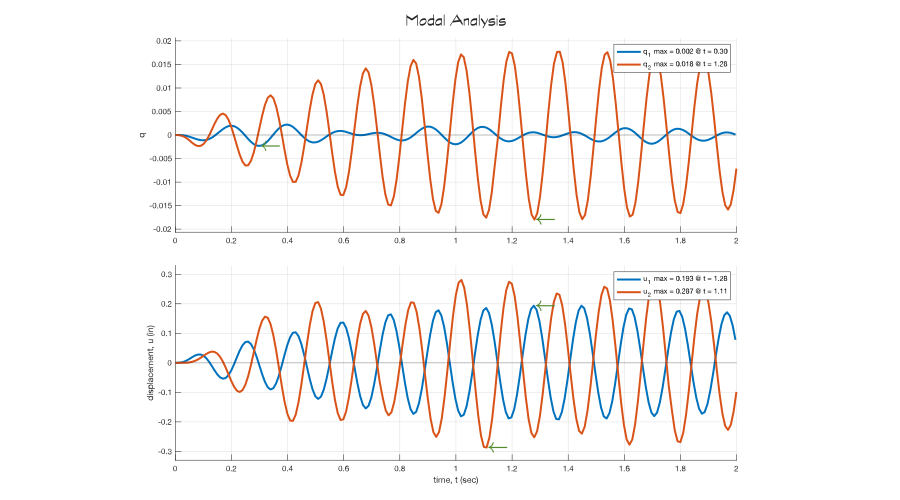
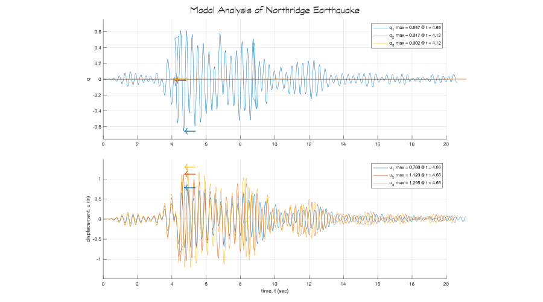
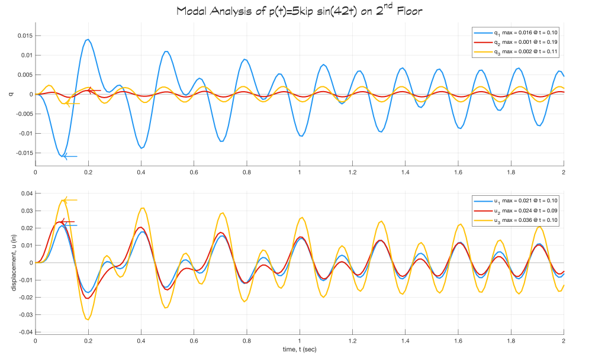
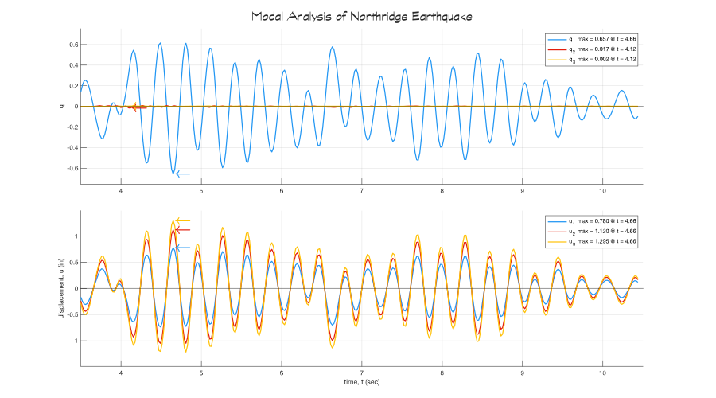

# Structural Dynamics

__Learning to evaluate the dynamics of a single and multiple degree of freedom structure subjected to earthquake ground motion.__

---

## Single Degree of Freedom

&boxbox; [Free Vibration](matlab/FVDsdof.m)

&boxbox; [Harmonic Loading](matlab/HL.m)

&boxbox; [Central Difference Method](matlab/CDMsdof.m)

---

## Multi Degree of Freedom

&boxbox; [Free Vibration](matlab/FVDmdof.m)

&boxbox; [Central Difference Method](matlab/CDMmdof.m)

&boxbox; [Modal Analysis Nodal Loading](matlab/MAinput.m)

&boxbox; [Modal Analysis Earthquake Data](matlab/MAeqdata.m)

